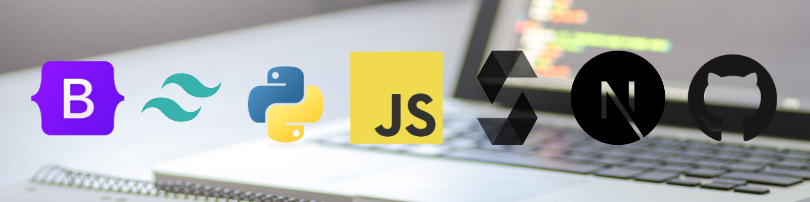

<h1 align="center">Hi 👋, I'm Mike Bivens</h1>
<h3 align="center">I'm a blockend dev, currently BUIDLing through the crypto winter</h3>

- 🔭 I’m currently working on building [Token Boards](https://github.com/MSBivens/token-boards)

- 🔭 I’m currently working on building [TheDrop](https://github.com/MSBivens/thedrop-website)

- 🔭 (Backburner Project) I’m working on building [WAGMI](https://mirror.xyz/0xc46C2e614c3Ec2B679961caf095204FbcFA23fAC/JyHpK5v72pLQ6tzhRweuTHfguaV7-ZCXq7ht-q2ufQg) Squad's [Website](https://github.com/MSivens/wagmi-squad-website), DAO, and its necessary components. 

- 🔭 (Backburner Project) I’m working on building [community-funding](https://github.com/MSBivens/community-funding)

- 🔭 (Backburner Project) I’m working on building [Road to Web3 Analytics](https://github.com/MSBivens/RW3-PoK-Analytics)

- 👯 I’m looking to collaborate on **exploring web3 via content production**

- 🤝 I’m looking for help with **DAO system design**

- 🌱 I’m currently learning **TypeScript & advanced NextJS materials**

- 👨‍💻 All of my projects are available at [www.msbivens.com](https://www.msbivens.com/)

- 📝 I write on [Mirror](https://mirror.xyz/0xc46C2e614c3Ec2B679961caf095204FbcFA23fAC) and [Medium](https://medium.com/@msbivens_)

- 📝 I previously reflected weekly on my journey to being a Web3 Dev on [Publish0x](https://www.publish0x.com/@senpaix)

- 💬 Ask me about **DAOs as the future of work**

- 📫 How to reach me **mikebiv95@gmail.com**

<h3 align="left">Connect with me:</h3>

<h3 align="left">Tech Stack:</h3>

 
     

<!-- 

 -->

&nbsp;

  

